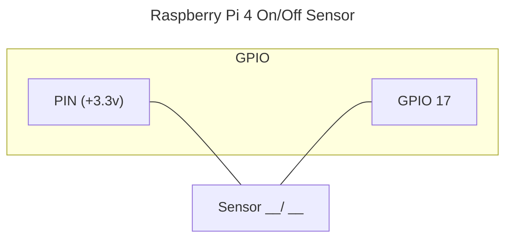
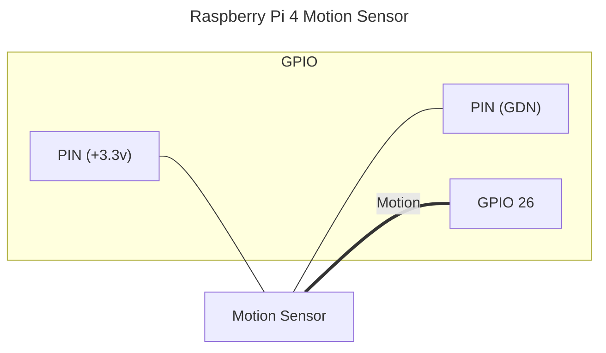
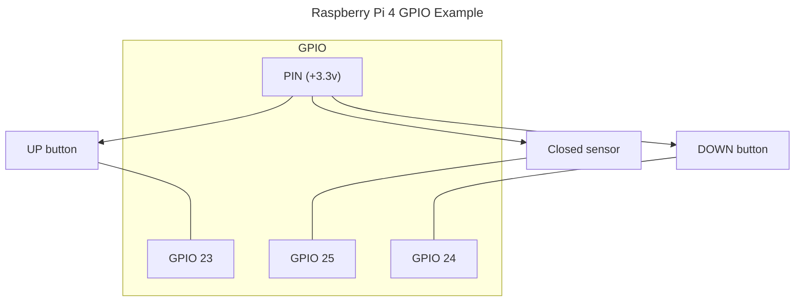
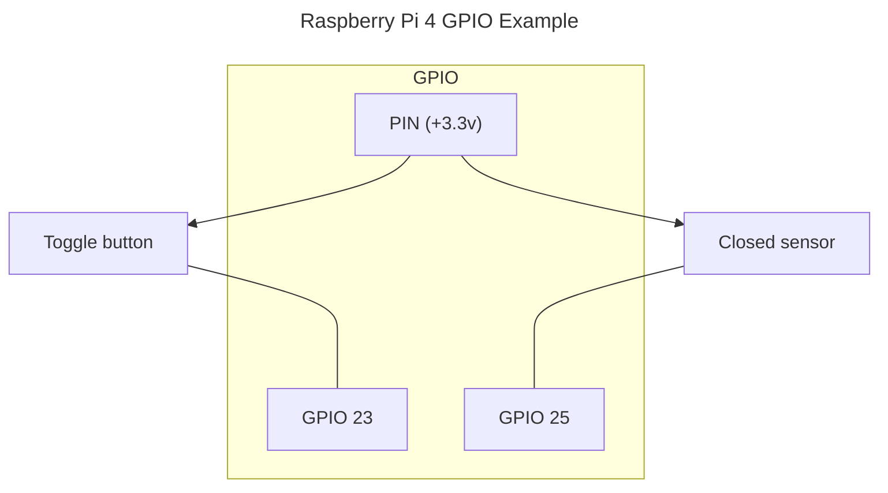
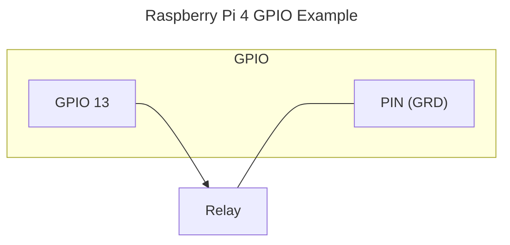
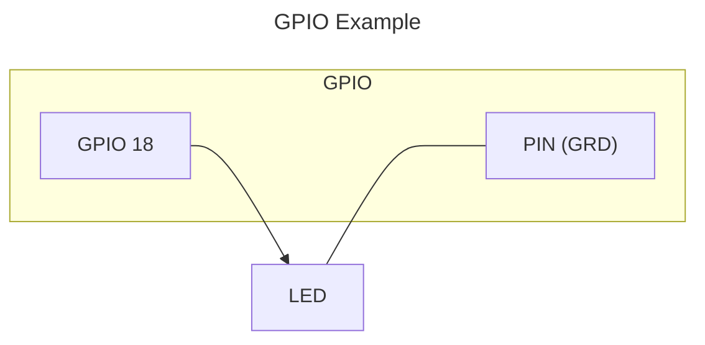
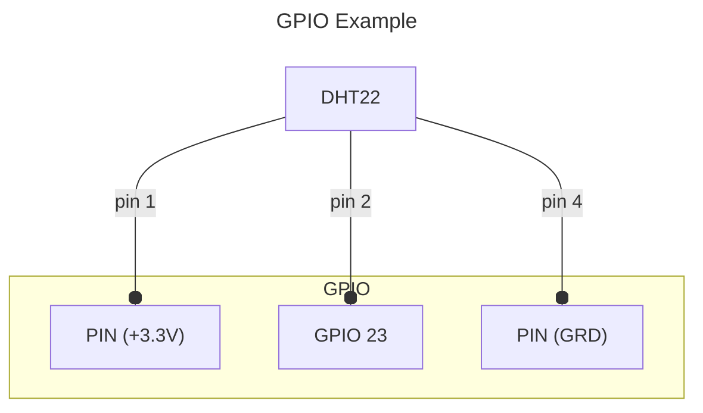

<!-- cspell:ignore hassfest, Rosen, Kolev, lgpio, gpiod, pigpiod, Poeschl, Hassio -->
[](https://github.com/custom-components/hacs)
[](https://github.com/rosenkolev/home-assistant-gpio-integration/releases)
[](https://github.com/rosenkolev/home-assistant-gpio-integration/actions/workflows/hacs.yml)
[](https://github.com/rosenkolev/home-assistant-gpio-integration/actions/workflows/release-drafter.yml)
[](https://github.com/rosenkolev/home-assistant-gpio-integration/actions/workflows/hassfest.yml)
[](https://github.com/rosenkolev/home-assistant-gpio-integration/actions/workflows/test.yml)

# Home Assistant Raspberry Pi GPIO custom integration

The `gpio_integration` integration supports the following platforms: Binary Sensor, Cover (ON/OFF and toggle), Switch

**Note:** The `port` refers to the GPIO number, not the pin number. See the [Wikipedia article about the Raspberry Pi](https://en.wikipedia.org/wiki/Raspberry_Pi#General_purpose_input-output_(GPIO)_connector) for more details about the GPIO layout.

**Note:** The integration is for `Raspberry Pi`.

## Supported Entities

* [x] Binary Sensor
* [x] Cover
* [x] Number
* [x] Switch
* [x] Light
* [x] Fen
* [x] Sensor

## Installation

### HACS

The recommend way to install `gpio_integration` is through [HACS](https://hacs.xyz/).

### Manual installation

Copy the `gpio_integration` folder and all of its contents into your Home Assistant's 
`custom_components` folder. This folder is usually inside your `/config` 
folder. If you are running Hass.io, use SAMBA to copy the folder over. You 
may need to create the `custom_components` folder and then copy the `gpio_integration` 
folder and all of its contents into it.

## Interface

It uses `pigpio` package as default interface to access the GPIOs and fallback to other options when `pigpio` is not found. You should ensure at least 1 of the packages are installed.

See [Interface Advanced Configuration section](#interface-advanced-configuration).

The [gpiozero](https://gpiozero.readthedocs.io/) library is used and the integration supports all interfaces `gpiozero` supports.

* pigpio
* lgpio (fallback)
* rpigpio (fallback)
* native (fallback)

The integration is created in a way that can be extended for other hardware like 'Asus Tinker Board' or 'ODroid' but I don't have the hardware to implement it and anyone is welcome to do so (see [Development section](#development))

## Usage

### Configuration

To configure the integration use the UI


#### Notes

* unique_id is not required and will be created automatically based on `Name`
* **Pin numbers are GPIO pin numbers and not the actual pin order of the board**

### Entities / Types

#### Binary Sensor

Binary sensor set state based on GPIO pin input (ON = 3.3v, OFF = 0v) or based on RISING/FALLING events for some `Motion` or `Vibration` sensors (when "Event timeout" is set).

RISING/FALLING events are when pin input have a current goes from 0v to 3.3v (rising) or goes down from 3.3v to 0 (falling).

##### Examples





##### Options

|  | |
| - | - |
| Name | The name of the entity |
| GPIO pin | The number of the input pin. |
| Bounce time (in milliseconds) | A time between GPIO input updates are detected [default `200`ms]. |
| Invert logic | A invert logic. When checked, and the GPIO input is HIGH (3.3v) the state of the sensor will be `Off` (0v = `On`). Only apply when "Event timeout in seconds" is 0 [default `False`]. |
| Mode | Sensor type [default `Door`] |
| Default state | The initial state of the sensor, before the GPIO input is read [default `False`/`Off`]. |
| Event timeout in seconds | The time, sensor data is considered up to date. For example when set to 3sec and motion (edge event) is not detected from motion sensor for 3sec, the state is considered `Off` or `no motion` [default `0`]. |
| Unique ID | Optional: Id of the entity. When not provided it's taken from the `Name` or auto-generated. Example 'motion_sensor_in_kitchen_1' [default '']. |

#### Cover with up and down button (optional sensor)

The type defines the home assistant entities **Cover** (_features:_ `OPEN`, `CLOSE`, `STOP`, and `SET POSITION `) and **Number** (for setting a position).

This type consider having a cover (blind/roller/shade) remote or relays with up/down/stop buttons.

##### Example



##### Options

|  | |
| - | - |
| Name | The name of the entity |
| GPIO close pin | The GPIO pin number for the close relay/button |
| GPIO close pin invert(default 3.3v) | When checked and the button is pressed, the close pin output will be set to LOW (0v), when not pressed it will be HIGH (3.3v) [default `False`] |
| GPIO open pin | The GPIO pin number for the open relay/button |
| GPIO open pin invert(default 3.3v) | The same as the close invert [default `False`] |
| Relay time in seconds | The time in seconds a relay is active for the shade/cover/blind to be fully open/closed. Example, when set to 10 sec it's considered that to open a shade 50% we need to hold the UP button for 5sec [default `15`]  |
| Pin closed sensor | OPTIONAL, Input GPIO pin for a door closed sensor. When provided the state is set based on the sensor, otherwise it's assumed to be closed on initialization. [default `0`] |
| Mode | Cover type [default `Blind`] |
| Unique ID | Optional: Id of the entity. When not provided it's taken from the `Name` or auto-generated. Example 'motion_sensor_in_kitchen_1' [default ''] |

#### Cover with toggle button (optional sensor)

The type defines the home assistant entities **Cover** (_features:_ `OPEN`, `CLOSE`).

This type consider having a cover (blind/roller/shade) remote or relays with a single toggle button.

##### Example



##### Options

|  | |
| - | - |
| Name | The name of the entity |
| GPIO pin | The GPIO pin number for the relay/button |
| Invert logic | When checked, the pin output will be set to LOW (0v) when button is pressed and HIGH (3.3v) when not pressed [default `False`] |
| relay time in seconds | The time the button is being pressed [default `0.4s`] |
| Pin closed sensor | OPTIONAL, Input GPIO pin for a door closed sensor. When provided the state is set based on the sensor, otherwise it's assumed to be closed on initialization. [default `0`] |
| Mode | Cover type [default `Blind`] |
| Unique ID | Optional: Id of the entity. When not provided it's taken from the `Name` or auto-generated. Example 'motion_sensor_in_kitchen_1' [default ''] |

#### Switch

Creates a home assistant `Switch` entity, that sets a GPIO pin output.

##### Example



##### Options

|  | |
| - | - |
| Name | The name of the entity |
| GPIO pin | The GPIO pin number |
| Invert logic | When checked, the pin output will be set to LOW (0v) when switch is `On` and HIGH (3.3v) when switch is `Off` [default `False`] |
| Default state | The initial state of the switch [default `False`/`Off`] |
| Unique ID | Optional: Id of the entity. When not provided it's taken from the `Name` or auto-generated. Example 'motion_sensor_in_kitchen_1' [default ''] |

#### Light (PWM)

Creates a home assistant `Light` entity, that supports ordinary light and LED light output.

##### Example



##### PWM

The LED lights support different brightness levels based on Pulse-Wide Modulation. This means setting brightness based on impulses and not voltage:

```text

frequency |===================||==============|
cycle     |======|

HIGH - >  ,--.   ,--.   ,--.   ,--.   ,--.
          |  |   |  |   |  |   |  |   |  |
LOW  -----'  `---'  `---'  `---'  `---'  `---

```

Frequency 1Hz means 1 cycle per second.

Cycle is a combination from a HIGH and LOW state.
In the example above We have 2 time units HIGH and 3 units LOW.
This should indicate LED is at 40% brightness (2/5 every cycle).

##### Options

|  | |
| - | - |
| Name | The name of the entity |
| GPIO pin | The GPIO pin number |
| Frequency | The pulse-wide modulation PWM frequency used for LED lights, when set greater then 0 it's assumed it's a led light, when `None` or 0 it's assumed normal light bulb. [default `0`] |
| Default state | The initial state of the switch [default `False`/`Off`] |
| Unique ID | Optional: Id of the entity. When not provided it's taken from the `Name` or auto-generated. Example 'motion_sensor_in_kitchen_1' [default ''] |


#### Light (RGB/PWM)

The same as `Light (PWM)` but for a colored RGB LED.

##### Options

|  | |
| - | - |
| Name | The name of the entity |
| GPIO red color pin | The GPIO number for red pin |
| GPIO green color pin | The GPIO number for green pin |
| GPIO blue color pin | The GPIO number for blue pin |
| Frequency | The pulse-wide modulation PWM frequency used for LED lights, when set greater then 0 it's assumed it's a led light, when `None` or 0 it's assumed normal light bulb. [default `0`] |
| Default state | The initial state of the switch [default `False`/`Off`] |
| Unique ID | Optional: Id of the entity. When not provided it's taken from the `Name` or auto-generated. Example 'motion_sensor_in_kitchen_1' [default ''] |

#### Fen

Creates a home assistant `Fen` entity, that supports percentage and on/off state.
The Fen entity is similar to `Light` because it relays on PWM and have the same options.

##### Options

See `Light` (_features:_ `FLASH` and `Effect`) entity.

#### Sensors

##### DHT22 (humidity and temperature)

Sensor with serial data.




###### Options

|  | |
| - | - |
| Name | The name of the entity |
| GPIO pin | The GPIO pin number |
| Unique ID | Optional: Id of the entity [default ''] |


##### Analog step sensors (MCP300X, MCP320X)

Analog sensor based on the MCP chips and steps. See [the TMP36 example here](https://gpiozero.readthedocs.io/en/stable/recipes.html#measure-temperature-with-an-adc).

## Development

The code is located at `custom_components/gpio_integration`

```shell
custom_components/gpio_integration
  |- schemas/            #-> The config schematics for the entities
  |- controllers/        #-> A common controllers that handle entities (cover, sensors)
  |- __init__.py         #-> home assistant initialization code
  |- _devices.py         #-> wrappers around `gpiozero` Device classes
  |- _pin_factory.py     #-> functions that instantiate the correct pin_factory based on configs
  |- config_flow.py      #-> add/edit new entities logic: ConfigFlow, OptionsFlowHandler
  |- core.py             #-> common code like constants and base classes
  |- hub.py              #-> class shared between entities (facade)
  |- switch.py, number.py, etc #-> Home assistant entities
```

To create a new hardware implementation create new `Factory` and `Pin` ([gpiozero.pins](https://github.com/gpiozero/gpiozero/blob/master/gpiozero/pins/__init__.py)) child classes and implement it for the hardware. Then add it to `PIN_FACTORIES` in [_pin_factory](./_pin_factory.py).

## Interface Advanced Configuration

* pigpio - supports all features (require `pigpiod` running)
* rpigpio - `Home Assistant` OS uses [RPi.GPIO](https://pypi.org/project/RPi.GPIO/) python package that have [issue](https://github.com/raspberrypi/linux/issues/6037) preventing EDGE detection. When not using HA OS You must install alternative like [rpi-lgpio](https://pypi.org/project/rpi-lgpio/).

### pigpiod

`pigpio` connects to [`pigpio-daemon`](http://abyz.me.uk/rpi/pigpio/pigpiod.html), which **must be running**.

* On `Home Assistant` this daemon can be installed as an add-on [Poeschl/Hassio-Addons](https://github.com/Poeschl/Hassio-Addons/tree/master/pigpio).
* On `Raspbian` 2016-05-10 or newer the pigpio library is already included.
* On other operating systems it needs to be installed first ([see installation instructions](https://abyz.me.uk/rpi/pigpio/download.html)).

### Configure

You can force to use a specific underlying library by modifying the `configuration.yaml`.
By default `pigpio` will be use with `localhost` as host (`gpio = pigpio.pi()`).

```yaml
gpio_integration:
  interface: pigpio
  host: remote.pc
```

| | |
| - | - |
| interface | `pigpio`, `lgpio`, `rpigpio`, `native` |
| host | Host (only for pigpio) |

## Credits

This integration is developed by [RosenKolev][rosenkolev] and the code is located [here](https://github.com/rosenkolev/home-assistant-gpio-integration)
