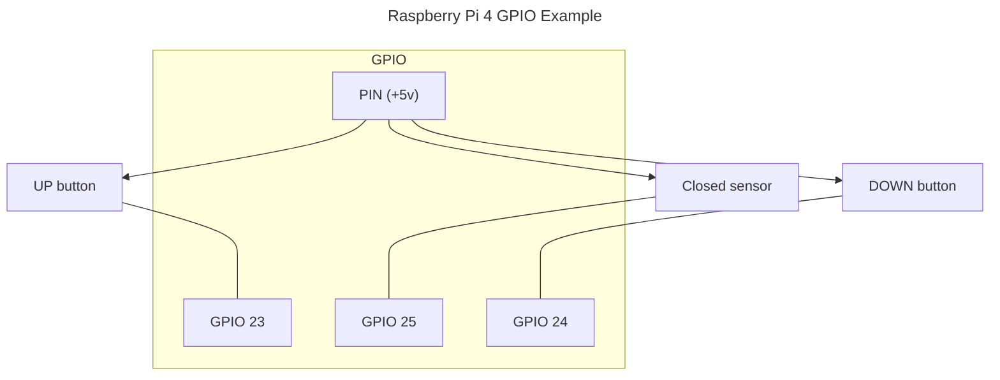
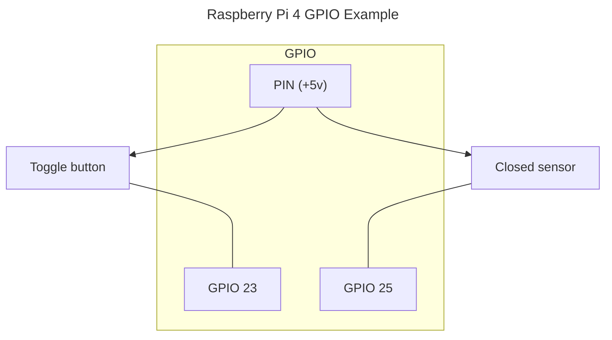
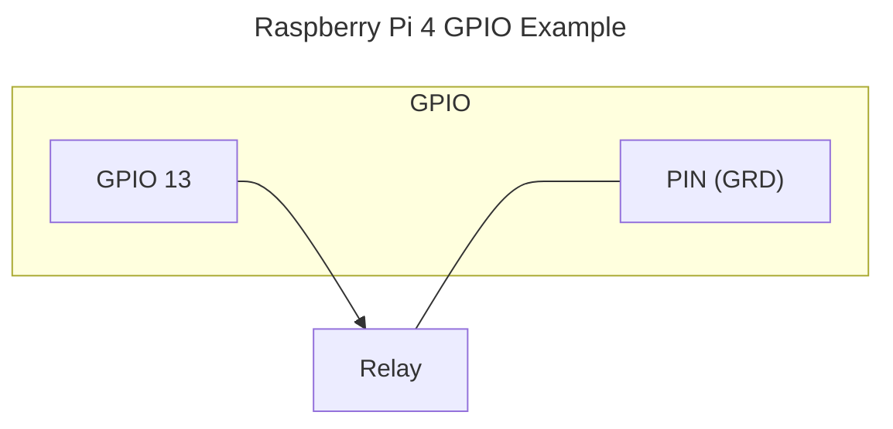
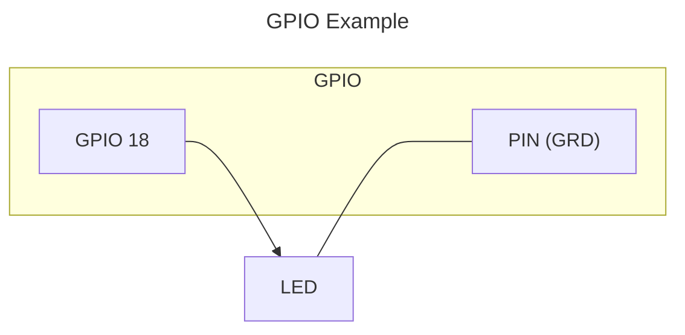

<!-- cspell:ignore hassfest, Rosen, Kolev -->
[](https://github.com/custom-components/hacs)
[](https://github.com/rosenkolev/home-assistant-gpio-integration/releases)
[](https://github.com/rosenkolev/home-assistant-gpio-integration/actions/workflows/hacs.yml)
[](https://github.com/rosenkolev/home-assistant-gpio-integration/actions/workflows/release-drafter.yml)
[](https://github.com/rosenkolev/home-assistant-gpio-integration/actions/workflows/hassfest.yml)
[](https://github.com/rosenkolev/home-assistant-gpio-integration/actions/workflows/test.yml)

# Home Assistant Raspberry Pi GPIO custom integration

The `gpio_integration` integration supports the following platforms: Binary Sensor, Cover (ON/OFF and toggle), Switch

**Note:** The `port` refers to the GPIO number, not the pin number. See the [Wikipedia article about the Raspberry Pi](https://en.wikipedia.org/wiki/Raspberry_Pi#General_purpose_input-output_(GPIO)_connector) for more details about the GPIO layout.

## Installation

### HACS

The recommend way to install `gpio_integration` is through [HACS](https://hacs.xyz/).

### Manual installation

Copy the `gpio_integration` folder and all of its contents into your Home Assistant's 
`custom_components` folder. This folder is usually inside your `/config` 
folder. If you are running Hass.io, use SAMBA to copy the folder over. You 
may need to create the `custom_components` folder and then copy the `gpio_integration` 
folder and all of its contents into it.

## Supported Entities

* [x] Binary Sensor
* [x] Cover
* [x] Number
* [x] Switch
* [x] Light

## Dependencies

The integration is for Home Assistant OS for `Raspberry Pi`.

It uses `pigpio` package (should be in the HA OS already) and fallback to `rpigpio` package when 'pigpio' is not found. When using the extension outside HA OS you should ensure at least 1 of this python packages are installed.

The integration is created in a way that can be extended for other hardware like 'Asus Tinker Board' or 'ODroid' but I don't have the hardware to implement it and anyone is welcome to do so (see Development section)

## Usage

### Configuration

To configure the integration use the UI

#### 1. Select the entity type


#### 2. Fill entity fields


#### Notes

* unique_id is not required and will be created automatically based on `Name`
* the `door closed` sensor is not required for `cover` and will be assumed to be closed initially, state will be tracked so if you use other remote to open/close may get out of sync
* **Pin numbers are GPIO pin numbers and not the actual pin order of the board**

### Entities / Types

#### Binary Sensor

Binary sensor set state based on GPIO pin input (ON = 5v, OFF = 0v) or based on RISING/FALLING events in the case of `Motion` or `Vibration` sensors.

RISING/FALLING events are when pin input have a current goes from 0v to 5v (rising) or goes down from 5v to 0 (falling).

|  | |
| - | - |
| Name | The name of the entity |
| GPIO pin | The number of the input pin |
| Pull mode | The default input mode (up/down) [default `up`]. |
| Bounce time (in milliseconds) | A time between GPIO input updates |
| Invert logic | A invert logic. When checked, and the GPIO input is HIGH (5v) the state of the sensor will be `Off` (0v = `On`). Only apply for non motion/vibration sensors, because this sensors rely on edge events [default `False`]. |
| Mode | Sensor type [default `Door`] |
| Default state | The initial state of the sensor, before the GPIO input is read [default `False`/`Off`] |
| Event timeout in seconds | The time, sensor data is considered up to date. For example when set to 3sec and motion is not detected from motion sensor for 3sec, the state is considered `Off` or `no motion`. Only applicable for `Motion`/`Vibration` mode |
| Unique ID | Optional: Id of the entity. When not provided it's taken from the `Name` or auto-generated. Example 'motion_sensor_in_kitchen_1' [default ''] |

#### Cover with up and down button (optional sensor)

The type defines the home assistant entities **Cover** (_features:_ `OPEN`, `CLOSE`, `STOP`, and `SET POSITION `) and **Number** (for setting a position).

This type consider having a cover (blind/roller/shade) remote or relays with up/down/stop buttons.

##### Example



##### Options

|  | |
| - | - |
| Name | The name of the entity |
| Up pin | The GPIO pin number for the up relay/button |
| GPIO up pin invert(default 5v) | When checked, the up pin output will be set to LOW (0v) when button is pressed and HIGH (5v) when not pressed [default `False`] |
| Down pin | The GPIO pin number for the down relay/button |
| GPIO down pin invert(default 5v) | The same as the up invert [default `False`] |
| Relay time in seconds | The time in seconds a relay is active for the shade/cover/blind to be fully open/closed. Example, when set to 10 sec it's considered that to open a shade 50% we need to hold the UP button for 5sec [default `15`]  |
| Pin closed sensor | OPTIONAL, Input GPIO pin for a door closed sensor. When provided the state is set based on the sensor, otherwise it's assumed to be closed on initialization. [default `0`] |
| Mode | Cover type [default `Blind`] |
| Unique ID | Optional: Id of the entity. When not provided it's taken from the `Name` or auto-generated. Example 'motion_sensor_in_kitchen_1' [default ''] |

#### Cover with toggle button (optional sensor)

The type defines the home assistant entities **Cover** (_features:_ `OPEN`, `CLOSE`).

This type consider having a cover (blind/roller/shade) remote or relays with a single toggle button.

##### Example



##### Options

|  | |
| - | - |
| Name | The name of the entity |
| GPIO pin | The GPIO pin number for the relay/button |
| Invert logic | When checked, the pin output will be set to LOW (0v) when button is pressed and HIGH (5v) when not pressed [default `False`] |
| relay time in seconds | The time the button is being pressed [default `0.4s`] |
| Pin closed sensor | OPTIONAL, Input GPIO pin for a door closed sensor. When provided the state is set based on the sensor, otherwise it's assumed to be closed on initialization. [default `0`] |
| Mode | Cover type [default `Blind`] |
| Unique ID | Optional: Id of the entity. When not provided it's taken from the `Name` or auto-generated. Example 'motion_sensor_in_kitchen_1' [default ''] |

#### Switch

Creates a home assistant `Switch` entity, that sets a GPIO pin output.

##### Example



##### Options

|  | |
| - | - |
| Name | The name of the entity |
| GPIO pin | The GPIO pin number |
| Invert logic | When checked, the pin output will be set to LOW (0v) when switch is `On` and HIGH (5v) when switch is `Off` [default `False`] |
| Default state | The initial state of the switch [default `False`/`Off`] |
| Unique ID | Optional: Id of the entity. When not provided it's taken from the `Name` or auto-generated. Example 'motion_sensor_in_kitchen_1' [default ''] |

#### Light

Creates a home assistant `Light` entity, that supports ordinary light and LED light output.

##### Example



##### Options

|  | |
| - | - |
| Name | The name of the entity |
| GPIO pin | The GPIO pin number |
| Frequency | The pulse-wide modulation PWM frequency used for LED lights, when set greater then 0 it's assumed it's a led light, when `None` or 0 it's assumed normal light bulb. [default `None`] |
| Default state | The initial state of the switch [default `False`/`Off`] |
| Unique ID | Optional: Id of the entity. When not provided it's taken from the `Name` or auto-generated. Example 'motion_sensor_in_kitchen_1' [default ''] |

## Development

The code is located at `custom_components/gpio_integration`

```shell
custom_components/gpio_integration
  |- gpio/
     |- __init__.py      #-> An abstract Pin class, for interface between the GPIO board and HA
     |- pigpio.py        #-> `pigpio` implementation for Raspberry PI
     |- rpigpio.py       #-> `rpigpio` implementation for Raspberry PI
     |- pin_factory      #-> methods to auto-create the hardware interface
  |- __init__.py         #-> home assistant initialization code
  |- config_flow.py      #-> add/edit new entities, ConfigFlow, OptionsFlowHandler
  |- config_schema.py    #-> the config schematics
  |- hub.py              #-> classes shared between entities, like the Roller (Cover, Number)
  |- switch.py, number.py, etc #-> Home assistant entities
```

To create a new hardware implementation create a new `Pin` child class and implement it for the hardware, then add it to `default_factories` at `pin_factory.py`.

## Credits

This integration is developed by [RosenKolev][rosenkolev] and the code is located [here](https://github.com/rosenkolev/home-assistant-gpio-integration)
