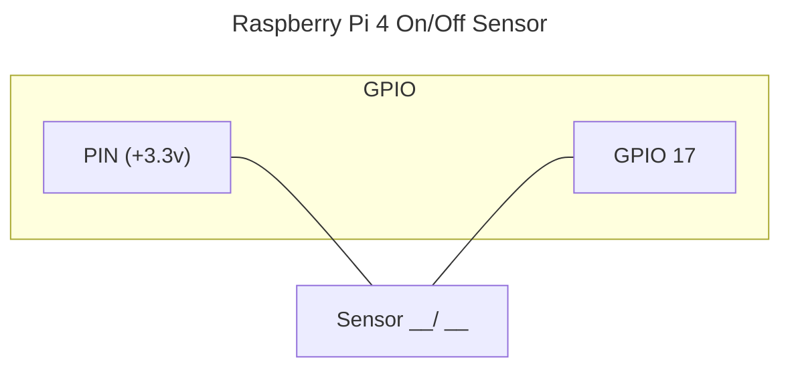
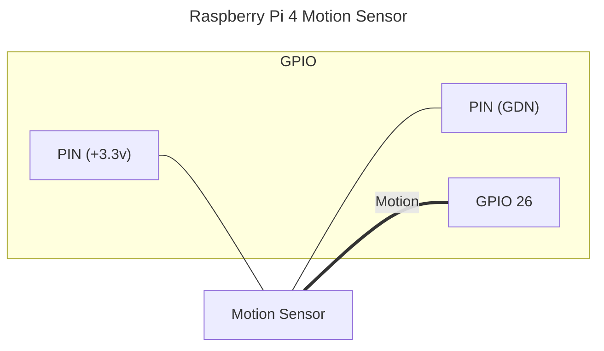

# Binary Sensor

Binary sensor set state based on GPIO pin input (ON = 3.3v, OFF = 0v) or based on RISING/FALLING events for some `Motion` or `Vibration` sensors (when "Event timeout" is set).

RISING/FALLING events are when pin input have a current goes from 0v to 3.3v (rising) or goes down from 3.3v to 0 (falling).

## Examples

## Options

|  | |
| - | - |
| Name | The name of the entity |
| GPIO pin | The number of the input pin. |
| Bounce time (in milliseconds) | A time between GPIO input updates are detected [default `200`ms]. |
| Invert logic | A invert logic. When checked, and the GPIO input is HIGH (3.3v) the state of the sensor will be `Off` (0v = `On`). Only apply when "Event timeout in seconds" is 0 [default `False`]. |
| Mode | Sensor type [default `Door`] |
| Default state | The initial state of the sensor, before the GPIO input is read [default `False`/`Off`]. |
| Event timeout in seconds | The time, sensor data is considered up to date. For example when set to 3sec and motion (edge event) is not detected from motion sensor for 3sec, the state is considered `Off` or `no motion` [default `0`]. |
| Unique ID | Optional: Id of the entity. When not provided it's taken from the `Name` or auto-generated. Example 'motion_sensor_in_kitchen_1' [default '']. |
