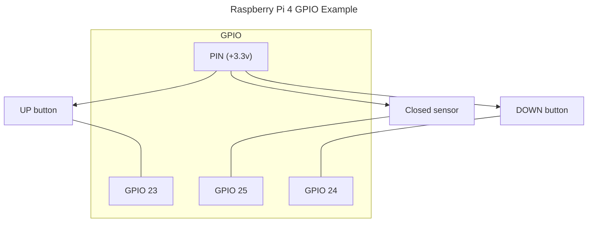
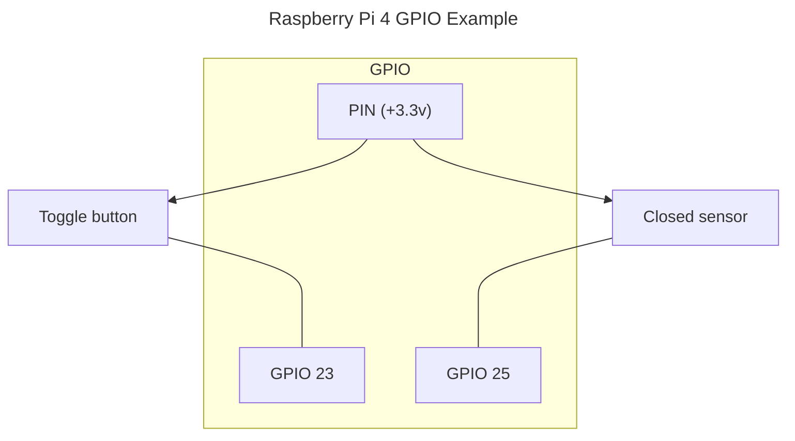

# Cover

## Cover with up/down switch

Entities for controlling `cover` (shade,roller,awning) with up/down button and an optional `closed` state sensor.

_**Entities**_

* Cover \
  `OPEN` `CLOSE` `STOP` `SET POSITION`
* Number

> The defines the home assistant entities **Cover** (_features:_ `OPEN`, `CLOSE`, `STOP`, and `SET POSITION`) and **Number** (for setting a position).

This type consider having a cover (blind/roller/shade) remote or relays with up/down/stop buttons.

#### Example

#### Options

|  | |
| - | - |
| Name | The name of the entity |
| GPIO close pin | The GPIO pin number for the close relay/button |
| GPIO close pin invert(default 3.3v) | When checked and the button is pressed, the close pin output will be set to LOW (0v), when not pressed it will be HIGH (3.3v) [default `False`] |
| GPIO open pin | The GPIO pin number for the open relay/button |
| GPIO open pin invert(default 3.3v) | The same as the close invert [default `False`] |
| Relay time in seconds | The time in seconds a relay is active for the shade/cover/blind to be fully open/closed. Example, when set to 10 sec it's considered that to open a shade 50% we need to hold the UP button for 5sec [default `15`]  |
| Pin closed sensor | OPTIONAL, Input GPIO pin for a door closed sensor. When provided the state is set based on the sensor, otherwise it's assumed to be closed on initialization. [default `0`] |
| Mode | Cover type [default `Blind`] |
| Unique ID | Optional: Id of the entity. When not provided it's taken from the `Name` or auto-generated. Example 'motion_sensor_in_kitchen_1' [default ''] |

## Cover with toggle switch

Entities for controlling `cover` (shade,blind,roller,awning) with a single toggle switch and an optional `closed` state sensor.

_**Entities**_

* Cover \
  `OPEN` `CLOSE`

#### Example

#### Options

|  | |
| - | - |
| Name | The name of the entity |
| GPIO pin | The GPIO pin number for the relay/button |
| Invert logic | When checked, the pin output will be set to LOW (0v) when button is pressed and HIGH (3.3v) when not pressed [default `False`] |
| relay time in seconds | The time the button is being pressed [default `0.4s`] |
| Pin closed sensor | OPTIONAL, Input GPIO pin for a door closed sensor. When provided the state is set based on the sensor, otherwise it's assumed to be closed on initialization. [default `0`] |
| Mode | Cover type [default `Blind`] |
| Unique ID | Optional: Id of the entity. When not provided it's taken from the `Name` or auto-generated. Example 'motion_sensor_in_kitchen_1' [default ''] |
