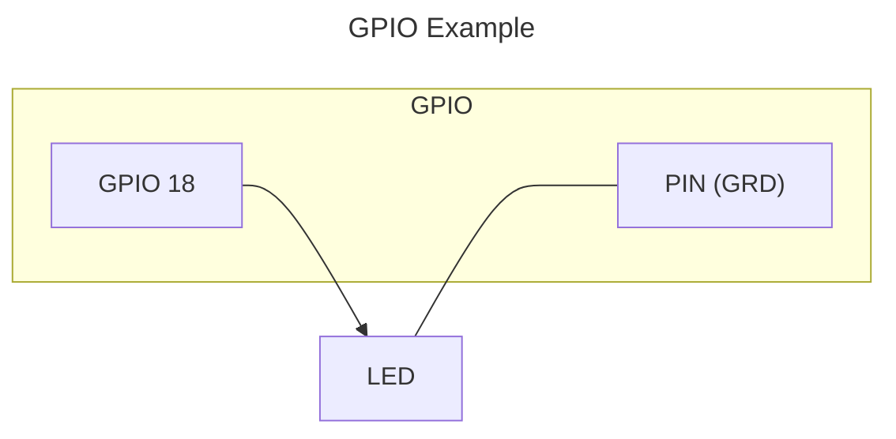

# Light

## Light PWM or Bulb

Creates a home assistant `Light` entity, that supports ordinary light and LED light output.

_**Entities**_

* Light \
  `FLASH` `EFFECT`

### Example



### PWM

The LED lights support different brightness levels based on Pulse-Wide Modulation. This means setting brightness based on impulses and not voltage:

```text

frequency |===================||==============|
cycle     |======|

HIGH - >  ,--.   ,--.   ,--.   ,--.   ,--.
          |  |   |  |   |  |   |  |   |  |
LOW  -----'  `---'  `---'  `---'  `---'  `---

```

Frequency 1Hz means 1 cycle per second.

Cycle is a combination from a HIGH and LOW state.
In the example above We have 2 time units HIGH and 3 units LOW.
This should indicate LED is at 40% brightness (2/5 every cycle).

### Options

|  | |
| - | - |
| Name | The name of the entity |
| GPIO pin | The GPIO pin number |
| Frequency | The pulse-wide modulation PWM frequency used for LED lights, when set greater then 0 it's assumed it's a led light, when `None` or 0 it's assumed normal light bulb. [default `0`] |
| Invert logic | When checked, the pin output will be reversed: **ON** = LOW (0v) and **Off** = HIGH (3.3v) [default `False`] |
| Default state | The initial state of the switch [default `False`/`Off`] |
| Unique ID | Optional: Id of the entity. When not provided it's taken from the `Name` or auto-generated. Example 'motion_sensor_in_kitchen_1' [default ''] |

## Light (RGB)

The same as `Light (PWM)` but for a colored RGB LED.

_**Entities**_

* Light \
  `FLASH` `EFFECT`

### Options

|  | |
| - | - |
| Name | The name of the entity |
| GPIO red color pin | The GPIO number for red pin |
| GPIO green color pin | The GPIO number for green pin |
| GPIO blue color pin | The GPIO number for blue pin |
| Invert logic | When checked, the pin output will be reversed: **ON** = LOW (0v) and **Off** = HIGH (3.3v) [default `False`] |
| Calibration red intensity | Calibration for red LED to equalize brightness across all three LEDs (0-100%). Used only when PWM is enabled [default `100`] |
| Calibration green intensity | Calibration for green LED to equalize brightness across all three LEDs (0-100%). Used only when PWM is enabled [default `100`] |
| Calibration blue intensity | Calibration for blue LED to equalize brightness across all three LEDs (0-100%). Used only when PWM is enabled [default `100`] |
| Frequency | The pulse-wide modulation PWM frequency used for LED lights, when set greater then 0 it's assumed it's a led light, when `None` or 0 it's assumed normal light bulb. [default `0`] |
| Default state | The initial state of the switch [default `False`/`Off`] |
| Unique ID | Optional: Id of the entity. When not provided it's taken from the `Name` or auto-generated. Example 'motion_sensor_in_kitchen_1' [default ''] |
