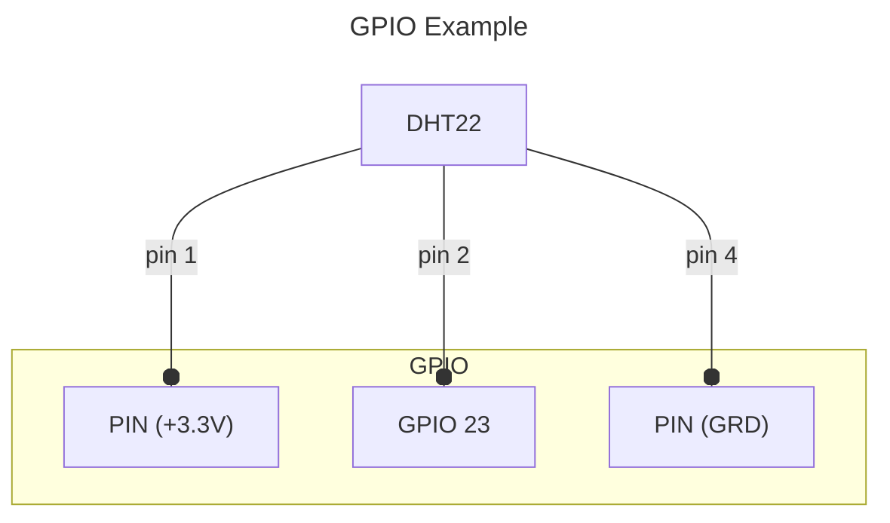

# Sensors

## Analog step sensor

Analog sensor based on the MCP chips and steps. See [the TMP36 example here](https://gpiozero.readthedocs.io/en/stable/recipes.html#measure-temperature-with-an-adc).

### Options

|  | |
| - | - |
| Name | The name of the entity |
| Chip | The TMP36 chip series (e.g. 'MCP3002') |
| Channel | The chip input channel [default 0] |
| Min voltage | The voltage corresponding to the minimum value [default 0] |
| Min value | The minimum value [default 0] |
| Step voltage | The voltage corresponding to the step value [default 0.1] |
| Step value | The step value [default 1] |
| Native unit | The native unit of measure |
| Unique ID | Optional: Id of the entity [default ''] |

### Example

We have a MCP3001 and a temperature sensor that measure between -10°C to 50°C with
a minimum voltage of 0.3V (equal -10°C) to 3.3V (equal 50°C). A min step is 1°C = 0.05V

* Chip = MCP3001, Channel = 0
* Min voltage = 0.1, Min value = -10.0
* Step voltage = 0.05, Step value = 1

When the temperature sensor output 2.3V the sensor shows 30°C

## Distance

An HC-SR04 ultrasonic distance sensor. The sensor requires two GPIO pins: one for the trigger and another for the echo.

Example can be found at [gpiozero recipes](https://gpiozero.readthedocs.io/en/stable/recipes.html#distance-sensor) page.

### Options

|  | |
| - | - |
| Name | The name of the entity |
| GPIO pin | The sensor **echo** pin |
| Trigger pin | The sensor **trigger** pin |
| Max distance | The sensor max distance value in meters |
| Unique ID | Optional: Id of the entity [default ''] |

## DHT22 (humidity and temperature)

Sensor with temperature and humidity values.

Should also work with **DHT11**

> [!Note]
> The sensor should be far from heat sources like raspberry pi cpu cooler

### Options

|  | |
| - | - |
| Name | The name of the entity |
| GPIO pin | The GPIO pin number |
| Unique ID | Optional: Id of the entity [default ''] |

### Example

