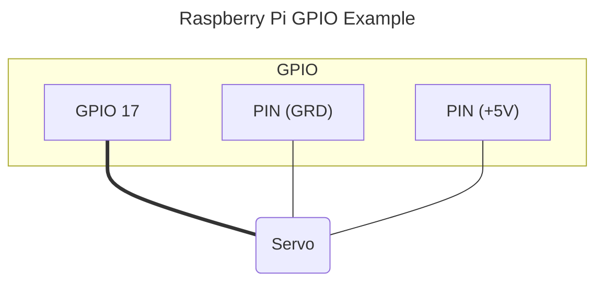

# Servo

Creates a `Number` entity, that controls a Servo motor.

## Example



```text
     duty cycle ms (min - max)       \\\
     |==|                             \\\  X°
     ,--.                           ,-------.
5V   |  |              |            | Servo |
-----'  `--------------'            `-------'
     |=================|
     frame width ms / frequency
```

## Options

| | |
| - | - |
| Name | Description |
| GPIO pin | The GPIO pin number |
| Min angle | The minimum angle the servo rotates to [default `-90°`] |
| Min duty cycle | The minimum duty cycle for the min angle in ms [default `1ms`] |
| Max angle | The maximum angle the servo rotates to [default `90°`] |
| Max duty cycle | The maximum duty cycle for the max angle in ms [default `2ms`] |
| frequency | The repeat period (i.e. frequency, frame width) in Hz [default `50Hz` (=`20ms`)] |
| Default angle | The initial angle of the servo motor [default `0°`] |
| Unique ID | Optional: Id of the entity. When not provided it's auto-generated. |
