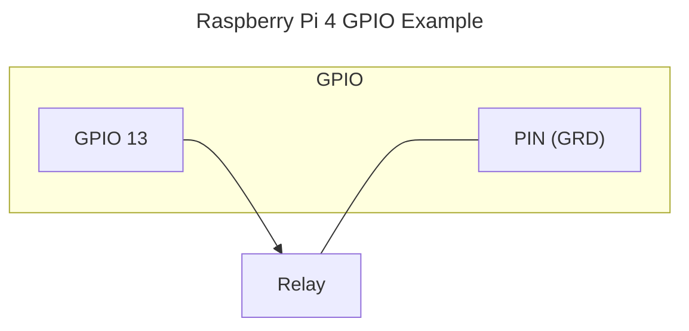

# Switch

Creates a home assistant `Switch` entity, that sets a GPIO pin output to HIGH (3.3V) or LOW.

## Example

## Options

|  | |
| - | - |
| Name | The name of the entity |
| GPIO pin | The GPIO pin number |
| Invert logic | When checked, the pin output will be set to LOW (0v) when switch is `On` and HIGH (3.3v) when switch is `Off` [default `False`] |
| Default state | The initial state of the switch [default `False`/`Off`] |
| Unique ID | Optional: Id of the entity. When not provided it's taken from the `Name` or auto-generated. Example 'motion_sensor_in_kitchen_1' [default ''] |
